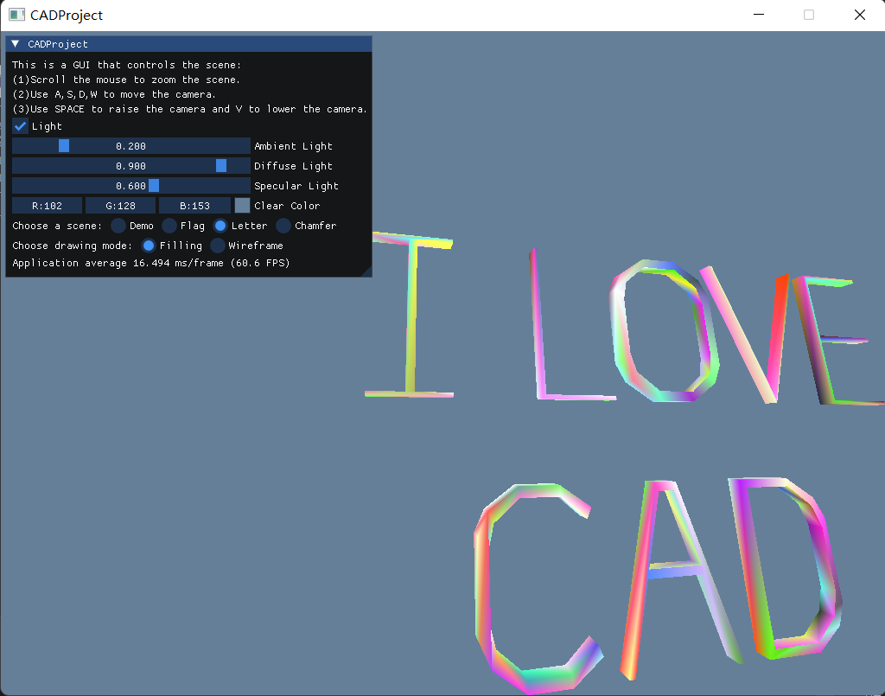

## 《三维CAD建模》课程作业（2023年秋季）
&emsp;&emsp;Hi，这是我第一次写README.md，也是我第一次使用github提交作业。我是浙江大学软件学院的研究生，也是开学前不久才从计算机视觉转到图形学方向，所以在这方面的基础比较薄弱。<br>
&emsp;&emsp;在该项目中，我首先搭建了基本的半边数据结构，确保能够准确地表示点、边、环、面和体之间的关系，并保证数据结构的相互关联正确。然后，我在这些拓扑结构的基础上实现了五个基本的欧拉操作mvsf、mev、mef、kemr、kfmrh和对应的**逆欧拉操作**，以及**semv操作**，通过正确的序列化和组合这些操作，便可以建立、编辑和调整三维模型，从而更灵活地满足具体的设计需求。有了欧拉操作后，我还编写代码实现了扫掠操作，使得一个面能够正确地从一个向量的起点扫掠到终点，并能够正确处理带有多个内环的二维区域。最后，利用OpenGL等图形库，我实现了将基于扫掠操作构建的实体模型在窗口界面中准确显示的功能。<br>
&emsp;&emsp;为了验证自己所写的算法是否正确，我构建了以下四个场景：
  >1）使用欧拉操作分别构建了带1和2个**通孔**的柱体；<br>
  >2）使用三角函数计算出国旗中五角星的顶点位置，并使用扫掠操作拉伸出国旗；<br>
  >3）使用扫掠操作分别拉伸出“I LOVE CAD”八个字母（选择这些字母的原因是兼顾通孔和**凹多边形**，而OpenGL不能直接渲染凹多边形，需要先进行三角化操作，因此可以验证绘制代码的准确性）；<br>
  >4）基于semv和逆欧拉操作，分别对柱体的棱角和棱边进行**倒角**和**倒边**操作。
  
&emsp;&emsp;这样，一步步完成每个任务，最终完成作业。Good luck！😊<br> 
<div align="center"></img></div>

### 项目说明
- 作业描述
  >1）定义半边数据结构；<br>
  >2）基于半边数据结构，实现五个基本欧拉操作；<br>
  >3）基于欧拉操作，实现扫掠操作（必须允许二维区域带多个内环），并将基于扫掠操作构建的实体模型进行真实感图形显示。<br>
  
- 项目结构
  ```
  CADProject  // 工程目录
  ├── CADProject.vcxproj                 //项目文件
  │── Headers                   //C++头文件
  │   ├── main.h                         //主界面设计
  │   ├── Camera.h                       //摄像机类
  │   ├── Draw.h                         //绘制函数
  │   ├── Example.h                      //构建场景
  │   ├── HalfEdgeDataStructure.h        //定义半边结构
  │   └── TopologicalOperations.h        //定义欧拉操作
  │── Sources                   //C++源文件
  │   ├── main.cpp                       //主界面设计
  │   ├── Camera.cpp                     //摄像机类
  │   ├── Draw.cpp                       //绘制函数
  │   ├── Example.cpp                    //构建场景
  │   ├── HalfEdgeDataStructure.cpp      //定义半边结构
  │   └── TopologicalOperations.cpp      //定义欧拉操作
  └── imgui.ini                 // gui文件
  └── IMGUI                     // gui依赖源码
  ```
- 环境设置
  - windows，VS2022，Debug，x86
  - OpenGL 3.3 Core

- 第三方依赖
  - GLFW：一个开源、跨平台的图形库，用于创建窗口和处理用户输入。[Download | GLFW](https://www.glfw.org/download.html)
  - GLEW：一个用于管理OpenGL扩展的开源库，简化了在不同系统上使用OpenGL的扩展功能的过程。(https://glew.sourceforge.net/index.html)
  - GLM：一个开源的数学库，专为OpenGL编程而设计，提供了向量、矩阵等数学运算功能。<br>(http://glm.g-truc.net/0.9.5/index.html)
  - GLUT：一个用于简化OpenGL应用程序开发的工具包，提供了窗口管理、事件处理等基本功能。(https://www.opengl.org/resources/libraries/glut/glut_downloads.php#3.6)
  - IMGUI：一个轻量级的、用于即时调试和开发的C++图形用户界面库，特别适用于游戏开发。(https://github.com/ocornut/imgui/releases)

- 使用方式
  - 键盘操作
    - WASD：控制摄像机前后左右移动
    - Q：渲染整个面，E：只渲染线框（废弃，使用UI代替）
    - 数字键：使用0、1、2切换场景（废弃，使用UI代替）
    - ESC：关闭程序
  - 鼠标操作
    - 移动：控制视角的转动
    - 滚轮：控制视角的大小
    - 单击：点击UI界面进行相关设置

- 其他功能
    - 构造了solid->move()方法以实现对整个实体在场景中移动位置的功能，使得实体局部节点之间的位置关系与全局坐标系无关；
    - 构造了一个FPS风格的可自由在3D场景中移动的摄像机：使用WASD键移动摄像机位置，使用鼠标移动视角，可通过调节参数大小来设置摄像机移动和转向的速度；
    - 利用ImGui库编写了一个图形化界面，可以使用鼠标点击相应按钮来实现不同功能，如修改渲染方式：渲染面或只渲染线框，修改背景颜色，选择不同场景等；
    - 在渲染时考虑了3种光照：环境光（ambient），漫反射光（diffuse）和镜面反射光（specular），可以通过UI界面中的滚动条修改光照参数。
      
- 心得与体会
    - 在我转向图形学方向，并投身CAD实验室后，经过短暂的时间里，我深感自己的基础相对薄弱。然而，在《三维CAD建模》这门课程中，我经历了一场知识的深度洗礼，感受到了学科的广度和深度。课程作业首先引导我们从底层开始，通过了解半边结构的原理，逐步构建起三维模型的基本框架。欧拉操作的引入更是让我领略到了建模过程的优雅之处，从简单的几何操作到复杂的模型构建，每一步都是一个巧妙而精密的谜题。这种深入的实践让我真切地体会到了理论知识与实际应用的联系，使我在动手实践中逐渐巩固和提升了我的技能水平。在课堂上，我还学到了很多之前未曾接触过的CAD领域的知识，这不仅拓展了我的视野，也让我深感图形学领域的博大精深。高老师不仅传授知识，更是激励我要继续深入研究，挖掘更多领域的奥秘。正是这门课程的全面涵盖和深度挖掘，让我对CAD建模有了更为清晰的认识。尽管我的基础相对薄弱，但通过这一段时间的学习，我深信只要保持努力和热情，就能够不断进步。这次经历不仅是对专业知识的补充，更是一次对自己学科选择的肯定，激励我在图形学领域不断深造，迎接更多的挑战。

- 不足之处
    - 没有实现Curve和Surface的接口，使得所画的实例全部由直线段构成；
    - 没有正确使用顶点的颜色和纹理坐标，使得国旗没有以正确的颜色显示。

如有任何问题，欢迎通过邮箱ffx@zju.edu.cn咨询！

### Reference
凹多边形的绘制：(https://blog.csdn.net/m0_52727721/article/details/128263015)<br>
ImGui实例解析：(https://www.cnblogs.com/FKdelphi/p/15251750.html)<br>
